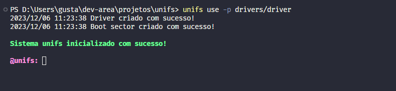
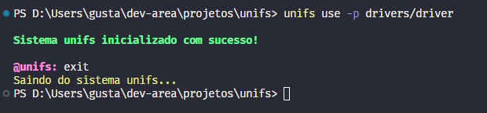

# UNIFS

[](https://forthebadge.com)
[](https://forthebadge.com)

Unifs é uma versão simplificada do FAT16, usando a linguagem Go. É apenas um projeto de aprendizado para sistemas de arquivos



## Instalação

Para gerar o executável

```bash

$ git clone github.com/gustaxz/unifs
$ cd unifs
$ go build

```

Caso queira instalar o executável e adicionais nas variáveis de ambiente do go

```bash
$ git clone github.com/gustaxz/unifs
$ cd unifs
$ go build
$ go install

```

## Uso

O unifs funciona emulando um arquivo do seu computador como se fosse um driver físico. Para isso, passe o caminho do arquivo que será usado como driver na flag `-p`

```bash
$ unifs use -p /path/to/file

```

Após isso, você entrará em um repl, onde poderá usar os comandos do unifs

### Comandos

-   `exit` : sai do repl



-   `clear` : limpa o terminal

-   `format` : formata o arquivo passado na flag `-p` para o sistema de arquivos unifs


